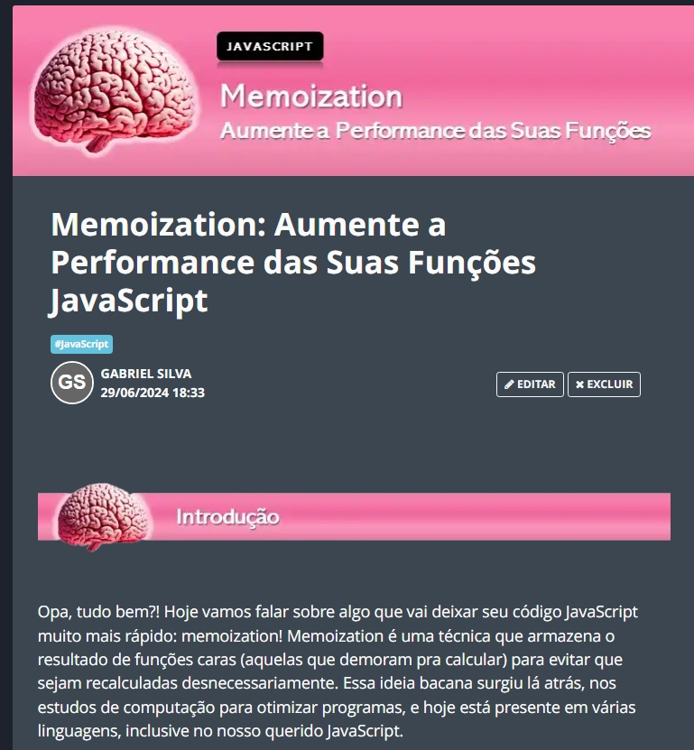

    

-------

  

# Projeto artigo técnico gerado por I.A.s

 > ℹ️ **NOTE:** Este repositório foi desenvolvido como parte da trilha de Fundamentos de IA para Devs do Santander Bootcamp 2024.

Projeto com o objetivo de gerar um artigo técnico com um layout rico, leitura agradável e com foco em promover autoridade técnica.

<a href="https://web.dio.me/articles/memoization-aumente-a-performance-das-suas-funcoes-javascript"> 📕Clique aqui para ler o artigo na DIO</a>

## 💻 Tecnologias utilizadas no projeto

- [ChatGPT](https://chat.openai.com/) - para título e conteúdo
- [Lexica.art](https://lexica.art/) - para gerar imagens
- [PowerPoint](https://www.microsoft.com/en/microsoft-365/powerpoint) - Para formatação de banners e Layouts

## 📄 Prompts e ferramentas

#### ChatGPT：

| Ação | Prompt |
| :--: | ------ |
|  Criar Título  | Crie 10 headlines para nomes de artigos sobre o assunto JS Memoization. |
| Gerar Conteúdo | Comporte-se como um escritor de artigos tech jovem e descontraído e escreva um artigo atendendo às {REGRAS}. {REGRAS} Escreva o artigo de maneira levemente informal, explicando seu conteúdo para o público iniciante em programação JS; Dê exemplo de códigos; Divida o artigo em blocos, com a média 5-10 linhas de conteúdo; O que é JS Memoization e onde surgiu; Onde utilizar; Quais os benefícios e os pontos de atenção; Onde os dados são armazenados; Como persistir os dados no navegador;Dê um exemplo de um código mão na massa de uma função Memo e como implementar; Ao final explique que o artigo foi criado por IA e revisado por um humano e deixe uma call action para meus próximos artigos; |

#### lexica.art:

| Ação | Palavra Chave |
| :--: | ------------- |
| Buscar Imagem Gerada por IA | JavaScript Brain |

## ✨ Features

- Conteúdo gerado via ChatGPT
- Imagens do acervo público geradas via Lexica.art

## 📚 Materiais

- prompts utilizados

## 🛠️ Instruções de execução

Utilize os prompts propostos acima nas ferramentas sugeridas, crie os banners com PowerPoint ou com sua ferramenta favorita, formate seu artigo diretamente na plataforma da DIO. Por fim, não deixe de revisar o conteúdo 😉!